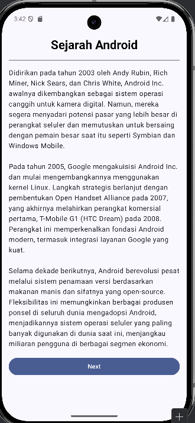
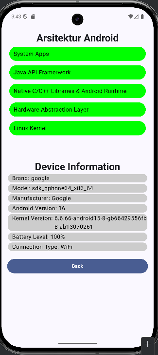

# Sejarah Android
### tugas 2 pemrograman mobile kelompok

> Anggota Kelompok:
> Muhammad Azma Al Faqih (2410817110008)
> Andre Cristian Nathanael (2410817210006)
> Badjradaka Herdinansyah Rahardjo (2410817210029)
> Adinda Lestari (2410817120015)
> 
## about
Aplikasi sederhana berisi sejarah singkat android, arsitektur android, dan menampilkan informasi device android

## how to run
1. clone repository pada terminal/cmd
```bash
git clone https://github.com/Ryuzora/Pemrograman-Mobile_Sejarah-Android.git
```

2. Buka folder repo yang telah diclone dengan android studio

3. pada android studio, lakukan run dengan menekan tombol ▶️ pada bagian atas atau bisa juga dengan menekan tombol Shift+F10

4. Aplikasi berhasil dijalankan

## images



